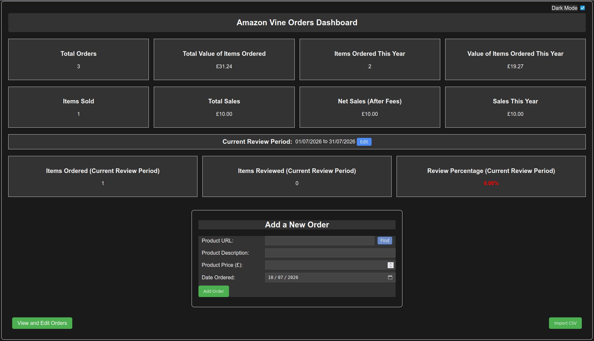
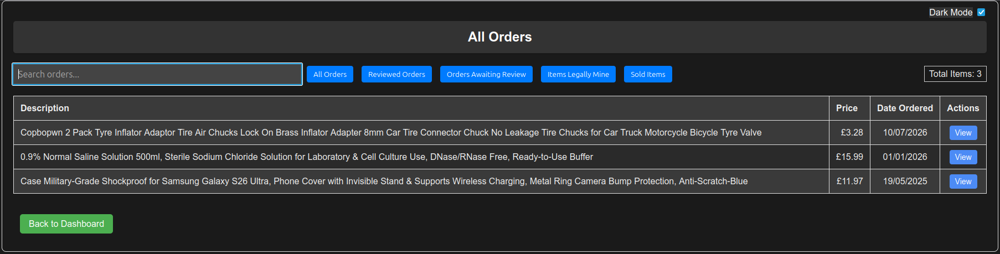
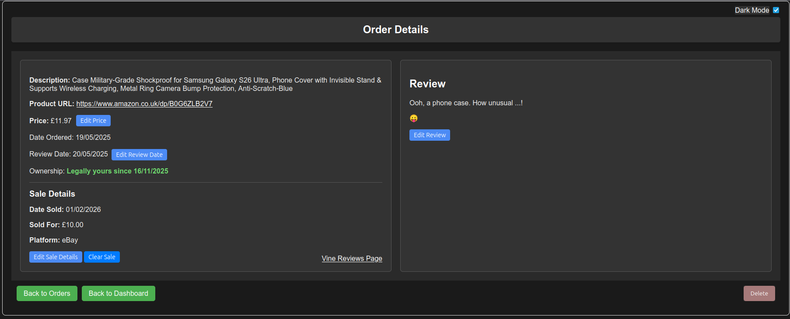

# vine-orders-app

A self-hosted web app to track your Amazon Vine orders, reviews and sales.

This Flask application was originally written almost entirely by ChatGPT. Other than fixing obvious mistakes I noticed it make, my only input was telling it what I wanted, liked and didn't like, a little bit of CSS and HTML and a lot of beta testing and banging my head on the table because, while ChatGPT is actually quite clever, it's also exceptionally stupid sometimes and has the memory retention of a fish! Version 2.0 added sales tracking and a general tidy-up, this time with help from Anthropic's Claude.

## Features

- **Dashboard** with statistics: total orders, total value, items ordered this year and their value
- **Review period tracking** - set your six-month evaluation period and see items ordered, items reviewed and your review percentage at a glance (green when you're meeting the 80-item / 90% requirements, red when you're not)
- **Add orders** by pasting the Amazon URL - the Find button scrapes the description and price for you
- **Review management** - write reviews in Markdown with a built-in editor, track review dates and due dates
- **Ownership tracking** - each item shows when it becomes legally yours (six months after the review date), with an "Items Legally Mine" filter
- **Sales tracking** - mark items as sold with the date, sale price, platform and optional fees. The platform is free text with autocomplete from your previous entries, so it works with eBay, Vinted, Facebook Marketplace or anywhere else you sell. The dashboard shows items sold, total sales, net sales after fees and sales this year, and the orders page has a Sold Items filter
- **Search and filters** with pagination and a page-jump box for large collections
- **CSV import** for your Amazon data export, plus a separate script to bulk-import prices
- **Dark mode**, because of course

A few images of the app:

## Installation

This is a Python project so you will need to install Python if it is not already installed. I used 3.12 for my Docker setup but any recent version should work. See [Python.org](https://www.python.org/downloads/). Linux users should already have Python installed so can move straight to the next step.

To install the dependencies in requirements.txt you will need pip. Please see the [pip documentation](https://pip.pypa.io/en/stable/installation/).

If you want to run this script as a Docker container you will also need to install Docker. Instructions can be found on the [dockerdocs website](https://docs.docker.com/engine/install/).

Once installed you simply need to run app.py from the command line / terminal (which will start the simple web server). This will either be in the form of 'python app.py' or 'python3 app.py', depending on your Operating System. Once you have it working you can add a desktop shortcut to launch it if you are not running it 24/7 in a Docker or other web server. The other alternative is to set it up as a scheduled task (Windows) or cron job (Linux) so it starts at login.

If you are running the app on your local machine then it will be available in your web browser at http://127.0.0.1:5000/. Substitute the IP address if you are running the app on a different machine. The port number can also be changed by editing app.py. At the very bottom of the script you will see the line:

> app.run(host='0.0.0.0', port=5000)

Change the port number as required, save the file and then restart the app and adjust the browser URL port.

## Updating from an earlier version

Your existing database is upgraded automatically - the first time the new version starts it adds the sales tracking columns and tidies a few data quirks, with no manual steps needed. It's still sensible to take a copy of vine_orders.db first, as you should before any update.

If you run the app in Docker, note that the dependencies changed in v2.0 (pandas was removed and Flask was updated to 3.x), so you need to **rebuild the image** rather than just restarting the container.

## Import Vine Orders

While this was initially a hidden function, I received a request to add a button on the index page that allows you to import Vine orders. This should only import items where the URL does not already exist in the database.

First, download your data from Amazon. There should be a VineOrders.csv file, or something similar (rename it to VineOrders.csv if it has a different filename) which would have columns for url, date_ordered and description. Move this file to the root folder of the app (where app.py is) then press the 'Import CSV' button. If everything is in place you should see a popup message either confirming the data has been imported, including any new records that do not exist in the database, or that VineOrders.csv is missing from the root folder.

## Import Prices

There is also a separate Python script to import prices (import_prices.py). This exists because when I started playing with the program I only had the Amazon data that I requested which, as Vine items are free, all shows £0.00. I was considering manually entering all the prices, and started to do so. I then got exceptionally bored and, as I had another CSV file that I had been using up to that point that contained most of the prices, decided to have a script written to match the URLs and import the relevant prices. It expects a prices.csv file with url and price columns in the app's root folder.

## Sales Tracking

Open any order and press 'Mark as Sold'. Enter the date sold (defaults to today), what it sold for, the platform and any fees, and save. The order page then shows the sale details including the net amount after fees, with buttons to edit or clear the sale if you make a mistake. Sold items appear under the 'Sold Items' filter on the orders page, and the dashboard totals update automatically.

There's no hard enforcement of the six-month ownership rule - the app shows you the ownership status and politely assumes you know what you're doing.

## Notes on Price Scraping

The Find button works quite well with the only notable issue being scraping the price on certain items, but this is likely either because Amazon don't like it when we don't pay them to scrape product information from their site or that the product has no price information.

## Thanks

Thanks to Reddit user AussieA1 who shared the code from the Python tkinter app he created himself that gave me the idea for this app, and which helped me get the Find button working to scrape the description and price from the Amazon website.
